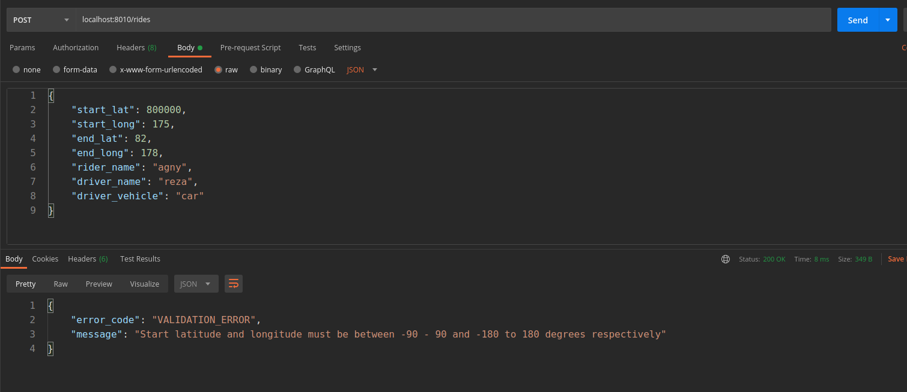
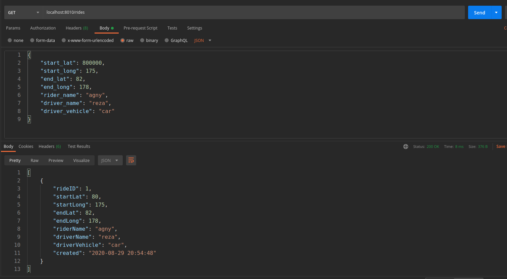
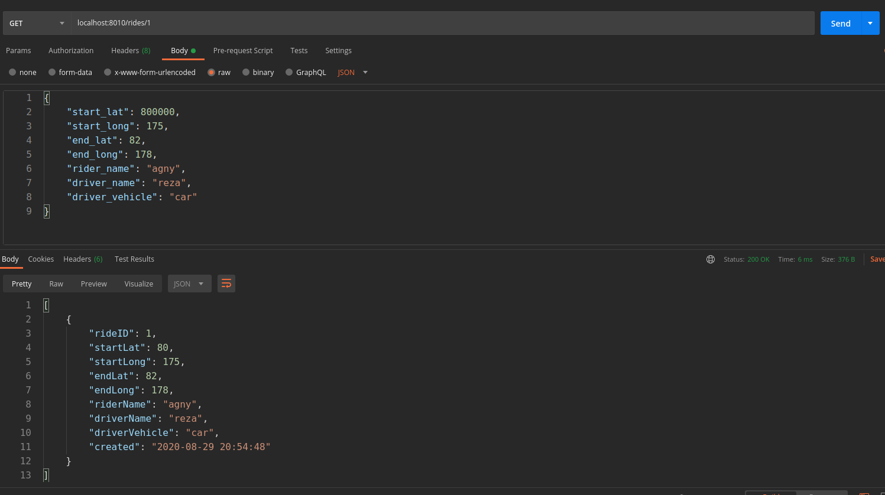

# Xendit Coding Exercise

The goal of these exercises are to assess your proficiency in software engineering that is related to the daily work that we do at Xendit. Please follow the instructions below to complete the assessment.

## Setup

1. Create a new repository in your own github profile named `backend-coding-test` and commit the contents of this folder
2. Ensure `node (>8.6 and <= 10)` and `npm` are installed
3. Run `npm install`
4. Run `npm test`
5. Run `npm start`
6. Hit the server to test health `curl localhost:8010/health` and expect a `200` response 

## Tasks

Below will be your set of tasks to accomplish. Please work on each of these tasks in order. Success criteria will be defined clearly for each task

1. [Documentation](#documentation)
2. [Implement Tooling](#implement-tooling)
3. [Implement Pagination](#implement-pagination)
4. [Refactoring](#refactoring)
5. [Security](#security)
6. [Load Testing](#load-testing)

### Documentation

Please deliver documentation of the server that clearly explains the goals of this project and clarifies the API response that is expected.

#### Success Criteria

1. A pull request against `master` of your fork with a clear description of the change and purpose and merge it
3. **[BONUS]** Create an easy way to deploy and view the documentation in a web format and include instructions to do so

#### Application Overview
This project is build Rest Apis for creating and retrieving Rides data.  We will build with [Node.js], [SQLite] and [Express.js].  Then, unit test using [Mocha] & [Chai] and code coverage with [Istanbul].

We define routes for handling create and read operations:

| Method        | Route                 | Action                                                |
|---------------|-----------------------|-------------------------------------------------------|
| POST          | /rides                | Add new Ride                                          |
| GET           | /rides                | Get all Rides                                         |
| GET           | /rides/:id            | Get Ride with spesific id                             |

#### Test the APIs
All APIs accessed from `localhost:8010`, all data is send and receives as JSON, using postman, we're gonna test all the Apis above.

 1. Create new Rider using `POST /riders` Api

    Request Body :

    ```
    {
        "start_lat": -90 to 90 <integer required>,
        "start_long": -180 to 180 <integer required>,
        "end_lat": -90 to 90 <integer required>,
        "end_long": -180 to 180 <integer required>,
        "rider_name": <string required>,
        "driver_name": <string required>,
        "driver_vehicle": <string required>
    }
    ```
    Status code : 200
    
    
    
    Status code : 400
    
    

2. Retrieve all rides using `GET /rides` Api 

    Status code : 200
    
    

3. Retrieve a single Ride by id using `GET /rides/:id` Api

    Status code : 200
    
    


4. All the Apis will get this response if server error 
    
    Status Code : 500

    

#### Deploy to Heroku
1. Create an Account at [Heroku]
2. If already login, click top right corner then create the app


3. In Dashboard you can found `download and install heroku cli`


4. after installation heroku cli, you can login to heroku cli 


4. Because heroku doesnt know how to run the app, create file Procfile
5. Insert `web: node index.js`
6. $ heroku git:remote -a {replace with app name}
6. $ git add .
7. $ git commit -m "deploy to heroku"
8. $ git push heroku master 
9. What if you want push the code to heroku with code in branch `development`
10. $ git push heroku development:master 
11. Click Open App at Dashboard


### Implement Tooling

Please implement the following tooling:

1. `eslint` - for linting
2. `nyc` - for code coverage
3. `pre-push` - for git pre push hook running tests
4. `winston` - for logging

#### Success Criteria

1. Create a pull request against `master` of your fork with the new tooling and merge it
    1. `eslint` should have an opinionated format
    2. `nyc` should aim for test coverage of `80%` across lines, statements, and branches
    3. `pre-push` should run the tests before allowing pushing using `git`
    4. `winston` should be used to replace console logs and all errors should be logged as well. Logs should go to disk.
2. Ensure that tooling is connected to `npm test`
3. Create a separate pull request against `master` of your fork with the linter fixes and merge it
4. Create a separate pull request against `master` of your fork to increase code coverage to acceptable thresholds and merge it
5. **[BONUS]** Add integration to CI such as Travis or Circle
6. **[BONUS]** Add Typescript support

### Implement Pagination

Please implement pagination to retrieve pages of the resource `rides`.

1. Create a pull request against `master` with your changes to the `GET /rides` endpoint to support pagination including:
    1. Code changes
    2. Tests
    3. Documentation
2. Merge the pull request

### Refactoring

Please implement the following refactors of the code:

1. Convert callback style code to use `async/await`
2. Reduce complexity at top level control flow logic and move logic down and test independently
3. **[BONUS]** Split between functional and imperative function and test independently

#### Success Criteria

1. A pull request against `master` of your fork for each of the refactors above with:
    1. Code changes
    2. Tests

### Security

Please implement the following security controls for your system:

1. Ensure the system is not vulnerable to [SQL injection](https://www.owasp.org/index.php/SQL_Injection)
2. **[BONUS]** Implement an additional security improvement of your choice

#### Success Criteria

1. A pull request against `master` of your fork with:
    1. Changes to the code
    2. Tests ensuring the vulnerability is addressed

### Load Testing

Please implement load testing to ensure your service can handle a high amount of traffic

#### Success Criteria

1. Implement load testing using `artillery`
    1. Create a PR against `master` of your fork including artillery
    2. Ensure that load testing is able to be run using `npm test:load`. You can consider using a tool like `forever` to spin up a daemon and kill it after the load test has completed.
    3. Test all endpoints under at least `100 rps` for `30s` and ensure that `p99` is under `50ms`


[Node.js]: <http://nodejs.org>
[Mocha]: <https://mochajs.org/>
[Chai]: <https://www.chaijs.com/>
[Express.js]: <https://expressjs.com>
[Istanbul]: <https://istanbul.js.org/>
[SQlite]: <https://www.sqlite.org/index.html>
[Heroku]: <https://www.heroku.com/#>